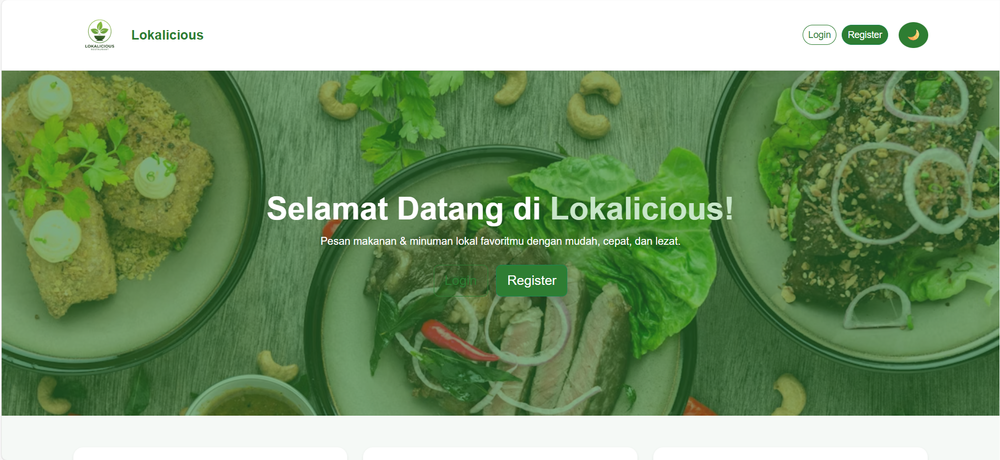
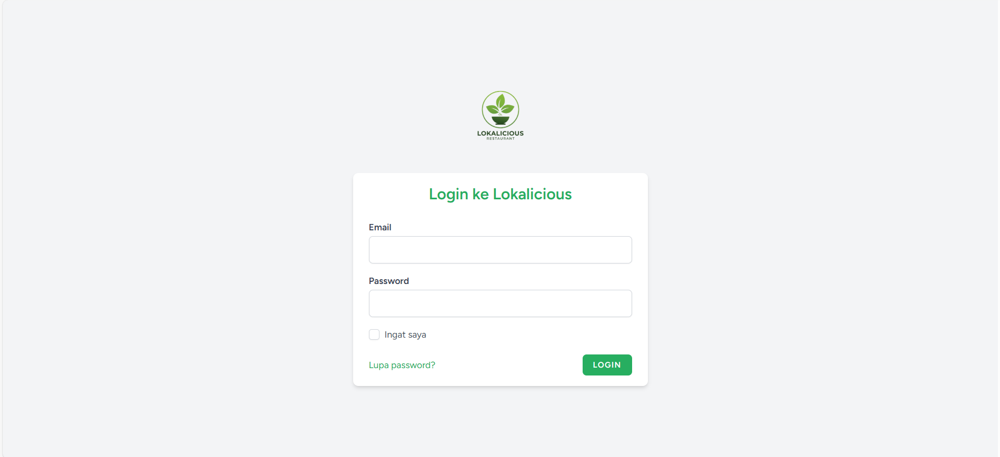
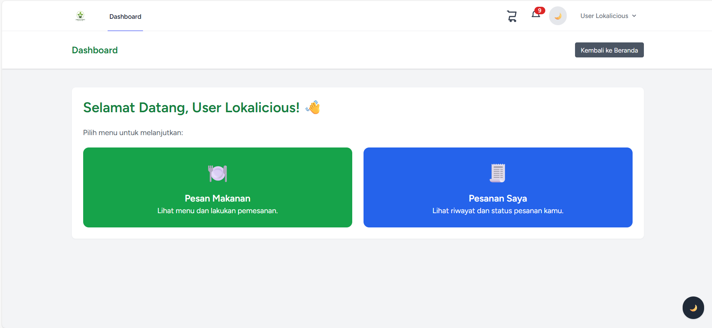
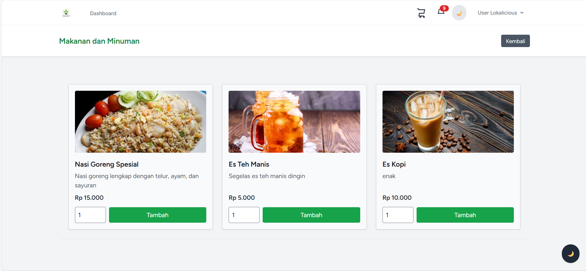
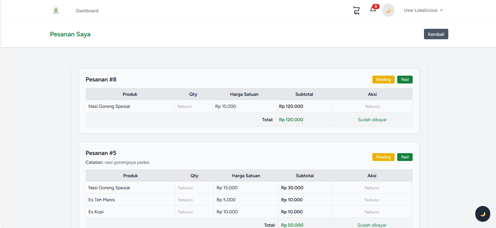
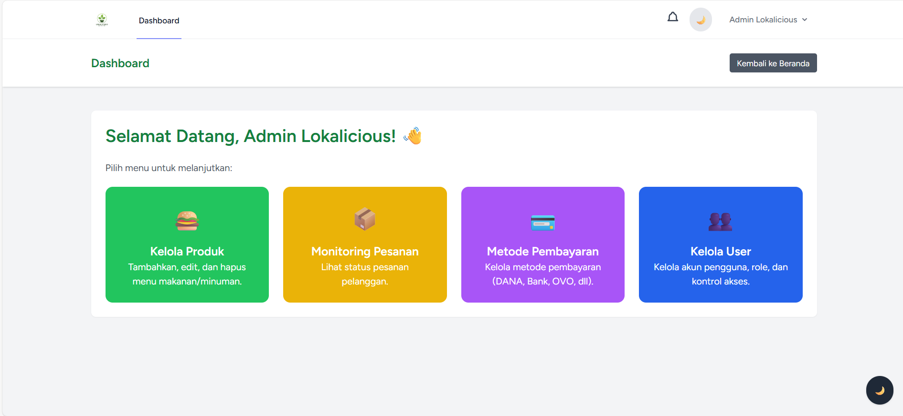
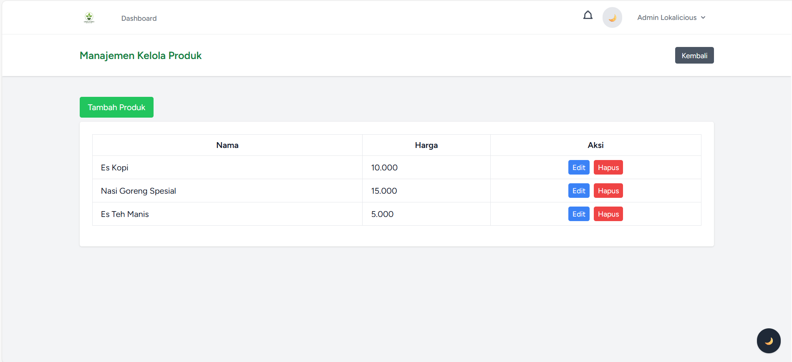
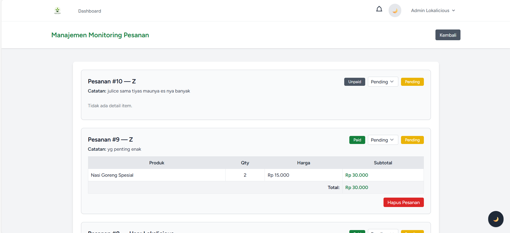
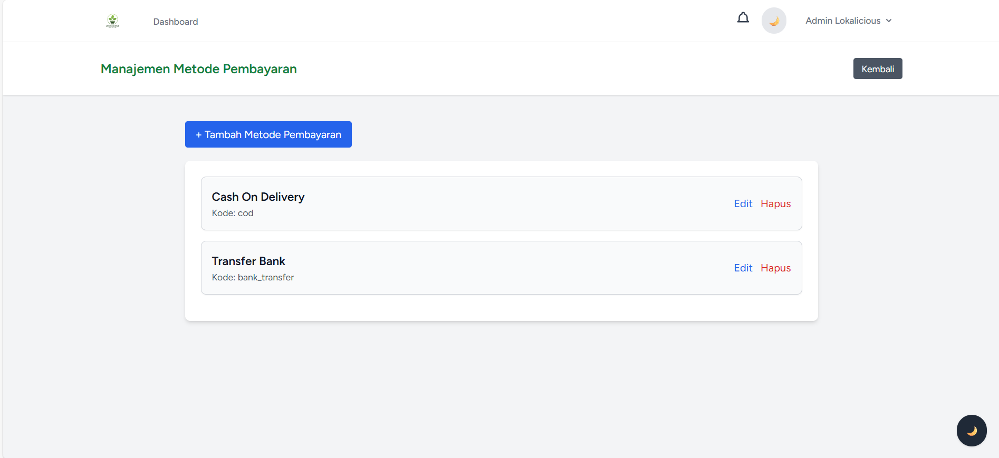
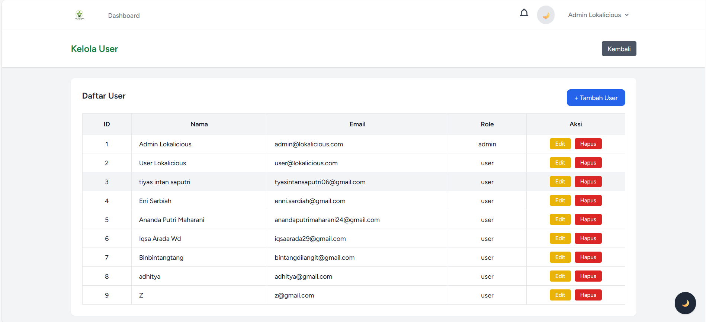

# 🍽️ Lokalicious — Web App Pemesanan Kuliner UMKM

Lokalicious adalah aplikasi web yang dikembangkan untuk membantu pelaku UMKM kuliner dalam:
- Memasarkan produk makanan/minuman
- Mengelola pesanan pelanggan
- Mengatur metode pembayaran
- Mengontrol akses pengguna berdasarkan role
- Menampilkan laporan pesanan secara ringkas & efisien

Aplikasi ini dibangun menggunakan Laravel dan Blade UI yang responsif serta mendukung **Dark Mode**.

---

## 📑 Daftar Isi
- [✨ Fitur Utama](#-fitur-utama)
- [🛠️ Tech Stack](#️-tech-stack)
- [📌 Persyaratan Sistem](#-persyaratan-sistem)
- [⚙️ Instalasi](#️-instalasi)
- [🔑 Role & Permissions](#-role--permissions)
- [🎯 Fitur Berdasarkan Role](#-fitur-berdasarkan-role)
- [🗂️ Struktur Database](#️-struktur-database)
- [🏛️ Arsitektur Sistem](#️-arsitektur-sistem)
- [🖼️ Screenshots Website](#️-screenshots-website)
- [🚀 Deployment](#-deployment)
- [📄 Lisensi](#-lisensi)

---

## ✨ Fitur Utama

| Fitur | Keterangan |
|------|------------|
| Dashboard | Menampilkan ringkasan pesanan dan produk |
| Login & Register | Autentikasi aman (Laravel Breeze) |
| Dark Mode | Tema Light/Dark dapat diganti |
| CRUD Produk | Tambah, edit, dan hapus menu makanan/minuman |
| Monitoring Pesanan | Daftar pesanan realtime |
| Update Status Pesanan | Pending → Success → Cancel |
| Metode Pembayaran | Transfer bank, e-wallet |
| Kelola User | Admin kelola role & akses pengguna |
| Pemesanan Makanan | Pelanggan dapat membuat pesanan |

---

## 🛠️ Tech Stack

**Backend**
- Laravel 10
- PHP 8.2+
- MySQL 8

**Frontend**
- Blade Template
- TailwindCSS (Laravel Breeze)

**Libraries/Tools**
- Laravel Breeze (Auth)
- Laravel Eloquent ORM

---

## 📌 Persyaratan Sistem

- PHP >= 8.1
- Composer
- Node.js & NPM
- MySQL
- Local Server (Apache/Nginx)

---

## ⚙️ Instalasi

```bash
# Clone repository
git clone https://github.com/username/lokalicious.git
cd lokalicious

# Install dependencies
composer install
npm install

# Copy environment config & generate key
cp .env.example .env
php artisan key:generate

# Konfigurasi database dalam file .env
# DB_DATABASE=lokalicious
# DB_USERNAME=root
# DB_PASSWORD=

# Migrasi database + seeder
php artisan migrate --seed

# Jalankan server dan frontend
npm run dev
php artisan serve
```


## 🔑 Role & Permissions

| Role | Akses |
|------|------|
| Admin | Kelola user, produk, pesanan, status |
| User (Pelanggan/UMKM) | Lihat produk, pesan makanan, kelola pesanan pribadi |

---

## 🎯 Fitur Berdasarkan Role

| Fitur | Admin | User |
|-------|:----:|:---:|
| Dashboard | ✔ | ✔ |
| CRUD Produk | ✔ | – |
| Buat Pesanan | – | ✔ |
| Edit/Hapus Pesanan sendiri | – | ✔ |
| Monitoring Pesanan | ✔ | ✔ |
| Update Status Pesanan | ✔ | – |
| Kelola User | ✔ | – |

---

## 🗂️ Struktur Database

**Tabel utama:**
- users
- products
- orders
- order_items
- payment_methods

**Relasi:**
- User **1 — n** Orders
- Order **1 — n** Order Items
- Product **1 — n** Order Items

---

## 🏛️ Arsitektur Sistem
```

+----------------+        +-----------------+        +----------------+
|  Client/Browser| <----> | Laravel Backend | <----> | MySQL Database |
+----------------+        +-----------------+        +----------------+
         |                          |
   Blade UI                     Order Logic
   TailwindCSS               Authentication & CRUD
```
---

## 🖼️ Screenshots Website

| Halaman | Tampilan |
|--------|:------:|
| Beranda ||
| Login/Register |  |
| Dashboard (user)|  |
| Daftar Produk (user) |  |
| Detail Pesanan (user)|  |
| Dashboard (admin) |  |
| Kelola Produk (admin) |  |
| Kelola Pesanan (admin) |  |
| Kelola Metode Pembayaran (admin) |  |
| Kelola User (admin) |  |
---

## 🚀 Deployment

```bash
composer install --optimize-autoloader --no-dev
npm run build
php artisan migrate --force

php artisan config:cache
php artisan route:cache
php artisan view:cache
```

## 📄 Lisensi

MIT License
Dikembangkan untuk Final Project Cloud Computing A-CC Kelompok 2 — Esteh Team 